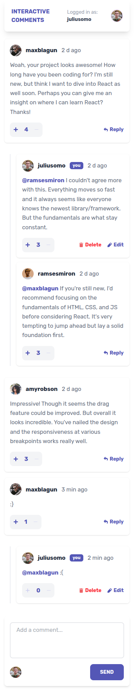

# Frontend Mentor - Interactive comments section solution

This is a solution to the [Interactive comments section challenge on Frontend Mentor](https://www.frontendmentor.io/challenges/interactive-comments-section-iG1RugEG9).

## Table of contents

- [Overview](#overview)
    - [The challenge](#the-challenge)
    - [Screenshot](#screenshot)
    - [Links](#links)
- [My process](#my-process)
    - [Built with](#built-with)
    - [Useful resources](#useful-resources)
- [Author](#author)

## Overview

### The challenge

Users should be able to:

- View the optimal layout for the app depending on their device's screen size
- See hover states for all interactive elements on the page
- Create, Read, Update, and Delete comments and replies
- Upvote and downvote comments
- **Bonus**: If you're building a purely front-end project, use `localStorage` to save the current state in the browser that persists when the browser is refreshed.
- **Bonus**: Instead of using the `createdAt` strings from the `data.json` file, try using timestamps and dynamically track the time since the comment or reply was posted.

### Screenshots

| Desktop View                                     | Mobile View                                    |
|--------------------------------------------------|------------------------------------------------|
|  |  |

### Links

- Solution URL: [GitHub](https://github.com/thyuhtooaung-dev/Interactive-comments-section)
- Live Site URL: [Vercel](https://interactive-comments-section-k469.vercel.app/)

## My process

### Built with

- [React](https://react.dev/)
- [Tailwind CSS](https://tailwindcss.com/)
- [TanStack Query (React Query)](https://tanstack.com/query/latest)
- [shadcn/ui](https://ui.shadcn.com/)
- [NestJS](https://nestjs.com/)
- [TypeORM](https://typeorm.io/)
- [Neon](https://neon.tech/)

### Useful resources

- [TanStack Query Docs](https://tanstack.com/query/latest/docs/react/overview) – Great for learning about server-state management, caching, mutations, and optimistic updates.
- [TypeORM Documentation](https://typeorm.io/) – Useful for working with entities, relations, repositories, and migrations in a type-safe way.

## Author

- Github - [Thyu Htoo Aung](https://github.com/thyuhtooaung-dev)
- Frontend Mentor - [@PoungMont](https://www.frontendmentor.io/profile/thyuhtooaung-dev)
- X - [@PoungMont](https://x.com/Poung_Mont)
